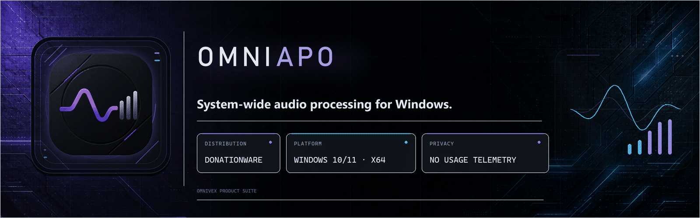
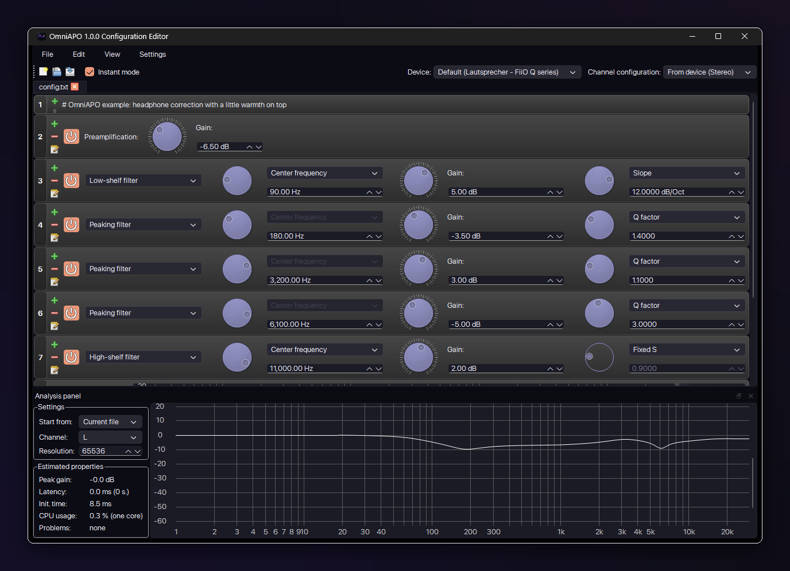
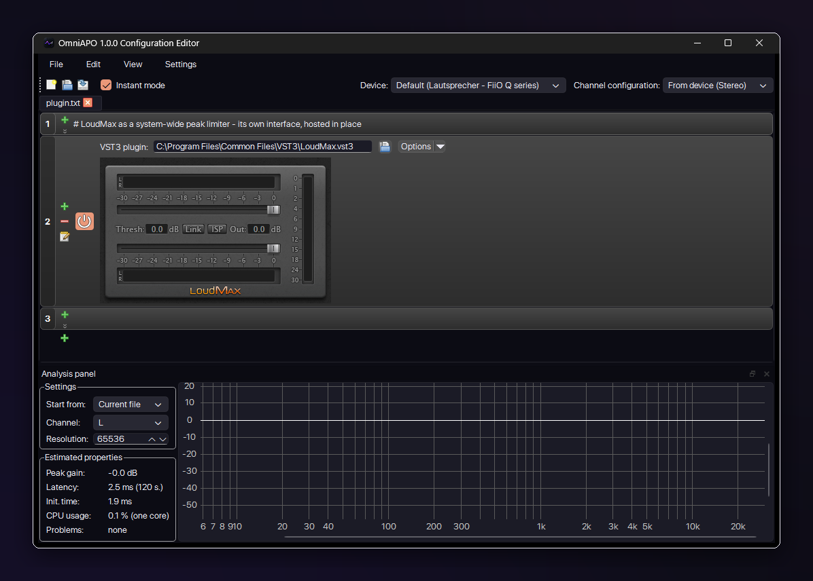
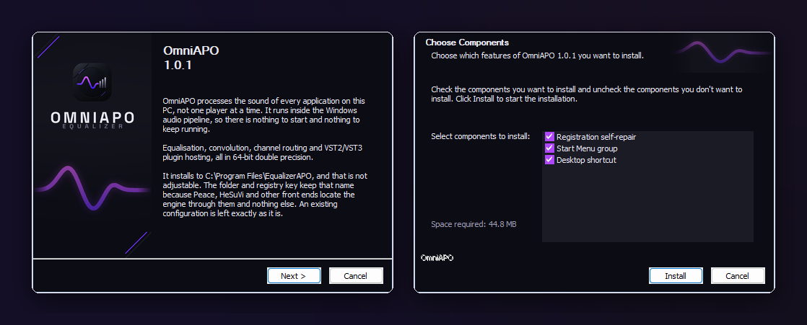
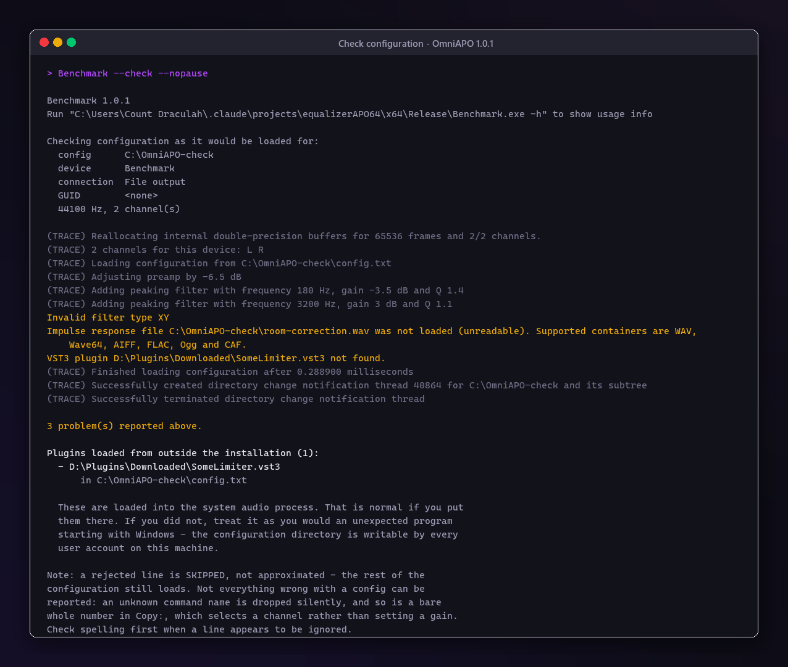
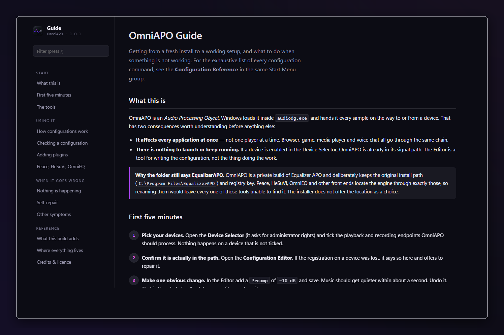
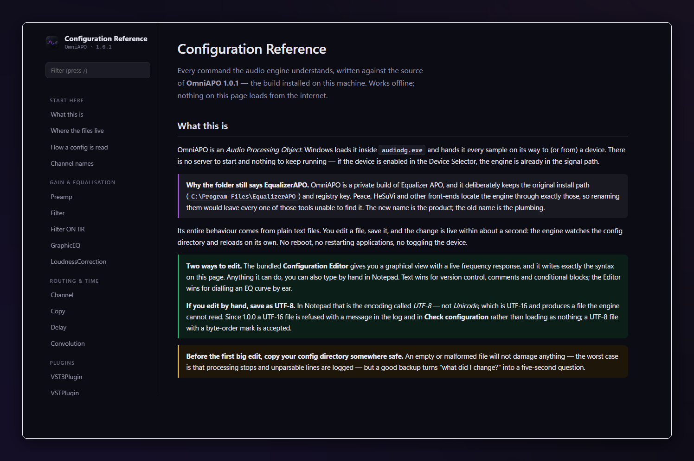

  

<h1 align="center">OmniAPO</h1>

<b>System-wide audio processing for Windows — a maintained Equalizer APO fork with double precision, VST3 hosting and a design of its own.</b>

Part of the <a href="#the-omnivex-suite">OmniVex</a> suite.

  
  &nbsp;
  

  
  
  
  
  

<!-- Quick navigation. These are clickable: each chip jumps to a section of this
     page, or to the document it names. Anchors are GitHub's own slugs for the
     headings below -- if a heading is renamed, its chip has to be renamed too. -->

  
  
  
  
  
  
  
  
  
  
  

> [!IMPORTANT]
> **Documentation-only repository.** This public repository contains OmniAPO documentation, approved artwork, and screenshots—not the application source tree, installer, binary releases, signing material, or private build infrastructure. Official distribution remains outside GitHub.

---

OmniAPO sits inside the Windows audio pipeline as an *Audio Processing Object*: every
sample on the way to or from a device passes through it. That means it works in every
application at once — your player, your browser, your game, your call — with no per-app
setup and no virtual cable.

It is a maintained fork of [Equalizer APO](https://sourceforge.net/p/equalizerapo/),
rebuilt in double precision, compiled for AVX2, given a VST3 plugin host, and finished
with a design of its own. First released as 1.0.0; 1.0.1 is a small correctness fix on top.

## At a glance

| | |
|---|---|
| **What it is** | A system-wide audio processor for Windows — EQ, convolution, routing and plugins applied to everything the PC plays or records |
| **Where it runs** | Inside `audiodg.exe`, the Windows audio engine. Nothing to launch, nothing to keep running |
| **Precision** | 64-bit double throughout the DSP, compiled for AVX2 |
| **Plugins** | VST3 (and VST2) effect plugins hosted in the audio path, their editors embedded in the Configuration Editor |
| **Configuration** | Plain text files, live-reloaded — or the Configuration Editor with a frequency-response plot |
| **Network** | None. No update check, no telemetry, no networking library linked |
| **Languages** | English, German, Spanish, French, Romanian — installer and all applications |
| **Compatibility** | Peace, HeSuVi and other Equalizer APO front ends keep working unchanged |
| **Licence** | GPL v3 or later — [what that means here](LICENSING.md) |

## What it does

**Equalisation and filtering.** Parametric and graphic EQ, biquad and IIR filters,
per-channel gain, delay, channel routing and copying, expressions with variables, and
loudness correction. All of it driven by plain text files you can edit in any editor —
or through the Configuration Editor, with a live frequency-response plot.

**Convolution.** Impulse responses for room correction, speaker correction or headphone
HRTF, in WAV, Wave64, AIFF, FLAC, Ogg or CAF.

**VST3 and VST2 plugins, in the audio path.** Load an effect plugin and it processes
system audio. The plugin's own editor window embeds in the Configuration Editor, and its
state is saved with your configuration. Sample format is negotiated per plugin, 32-bit
float or 64-bit double.

**It repairs itself.** A Windows update or an audio driver installation can silently wipe
OmniAPO's registration from a device, and the usual symptom is that your EQ just stops
working with nothing to explain it. A background check notices — at logon, when a device
is plugged in, and when the Editor starts — and offers a one-click repair.

**It tells you when a configuration is wrong.** `Check configuration` in the Start menu
reports every line the engine rejected, which otherwise only reaches a log file nobody
opens. It also lists any plugin loaded from outside the installation, so you can see what
is being pulled into the audio process.

## What makes this build different

| | |
|---|---|
| **Double precision throughout** | The DSP runs in 64-bit floating point, not 32-bit. Deep cuts and long filter chains do not accumulate the same error. |
| **AVX2** | Compiled for it, not merely capable of it. |
| **No network access at all** | Not a setting — a property. No update check, no version ping, no telemetry. The binaries link no networking library, which you can verify from their import tables rather than take on trust. |
| **Five interface languages** | English, German, Spanish, French, Romanian — in the installer and all three applications. |
| **Dark by design** | Not a dark theme bolted onto a light one. One considered palette, one typeface, one set of shapes — shared with the rest of the Omni tools. |
| **Documentation that ships with it** | A guide and a complete configuration reference, both offline HTML, both written for this build rather than inherited from a wiki. |
| **It plays well with others** | Peace, HeSuVi and other front ends keep working. The registry key, install path and configuration format are deliberately unchanged from Equalizer APO. |

## Screenshots

<table>
<tr>
<td width="50%"> <b>The Configuration Editor.</b> A correction chain with the live frequency-response plot underneath — every row is one line of the plain-text configuration.</td>
<td width="50%"> <b>A VST3 plugin in the audio path.</b> LoudMax as a system-wide limiter — its own interface embedded in the Editor, its state saved with the configuration.</td>
</tr>
<tr>
<td> <b>The installer.</b> Four pages, three choices, in five languages. Upgrades in place over an existing installation without touching the configuration.</td>
<td> <b>Check configuration.</b> Every line the engine would reject, and any plugin loaded from outside the installation — the error path, shown on purpose.</td>
</tr>
<tr>
<td> <b>The guide.</b> Offline HTML with a sidebar and live filter, written for this build.</td>
<td> <b>The configuration reference.</b> Every command the engine understands, written from the source — including the parts the wiki never mentioned.</td>
</tr>
</table>

## Honest limitations

These are the things worth knowing before you decide, not after.

- **Plugins run in-process.** They share `audiodg.exe` with the rest of the audio
  pipeline, so a badly-behaved plugin can disrupt system-wide audio rather than only its
  own chain. Processing faults are contained where the code can catch them; a plugin that
  corrupts memory is not something any in-process host can fully defend against.
- **Three plugins are verified end-to-end:** LoudMax, Airwindows Consolidated, TDR Nova.
  Others may work and have not been checked.
- **Impulse responses are decoded inside the audio process.** Only common containers are
  accepted, and the format is read from the file's header rather than its extension, but
  an impulse response from a stranger still deserves the caution you would give any
  downloaded binary.
- **A misspelled command name is dropped silently.** The engine does not report unknown
  commands, so the configuration checker cannot either. Check spelling first when a line
  seems ignored.
- **Plugin latency changes mid-stream** are applied at the next configuration reload, not
  immediately.
- **Built by one person, on one machine.** Offered as-is, with no support commitment
  behind it.

## Requirements

- Windows 10 or 11, **64-bit**
- A CPU with **AVX2** — anything from 2013 onwards (Intel Haswell, AMD Excavator)
- About 45 MB of disk space

There is no 32-bit and no ARM64 build.

## Get OmniAPO

A single download containing:

- **The installer** (`OmniAPO-x64-1.0.1.exe`) — five languages, and it upgrades in place
  over an existing installation without touching your configuration
- **A portable archive** (`OmniAPO-x64-1.0.1.zip`) — the same files, for inspection or for
  running the Editor and the checker without installing
- **The complete source code** (`OmniAPO-1.0.1-source.zip`) — the Corresponding Source
  for exactly these binaries, with the build script, test suites and dependencies
- **The documentation** — guide, configuration reference and readme, all offline
- **SHA-256 checksums** for everything above

&nbsp;&nbsp;

Donationware, plainly meant: nothing in OmniAPO is gated behind payment. No trial, no
nag screen, no reduced feature set, no phone-home. What a donation buys is the download
and the work behind it. The download is not published anywhere else.

## Documentation

The same documents ship inside the download and install into the Start menu; they are
here so you can read them before deciding.

- [**Guide**](docs/OmniAPO-Guide.html) — from a fresh install to a working setup, and what
  to do when something is not working ([PDF](docs/OmniAPO-Guide.pdf))
- [**Configuration reference**](docs/Configuration-Reference.html) — every command the
  engine understands, written from the source
- [**Readme**](docs/OmniAPO-README.pdf) — the short version, as a PDF
- [**Privacy**](PRIVACY.md) — local processing and network behavior
- [**FAQ**](FAQ.md) — common product, platform, and licensing questions
- [**Support**](SUPPORT.md) — what to include in a useful report
- [**Security**](SECURITY.md) — private vulnerability reporting
- [**Contributing**](CONTRIBUTING.md) — documentation and reproducible-report scope
- [**Changelog**](CHANGELOG.md)

GitHub shows HTML files as source; use the *Raw* view's download or open the file after
cloning to read the guide and the reference as pages.

## Quality

Seven test suites, 403 assertions, all passing at release. They cover the real-time audio
path including its zero-allocation guard, the VST3 module and plugin lifecycle, the
registration health-check classification, impulse-response container detection, filename
sanitisation and registry access.

They are ordinary executables with no test framework: each prints a line per case and
returns non-zero on failure, so the exit code is the whole contract. The installer
builds from the exact source in this download — the release manifest records the
SHA-256 of every file, and `OmniAPO-1.0.1-source.zip` is the Corresponding Source for
these specific binaries.

## Licence

**GNU General Public License, version 3 or later.**

That has consequences worth being clear about, in both directions:

- You may use it for anything, including commercially.
- You may study, modify and redistribute it — including giving it away for free.
- If you distribute it, modified or not, you must pass on the same freedoms and make the
  source available.

The donation model and the licence are not in conflict: the GPL explicitly allows charging
for the act of distribution. It does not let anyone — including me — restrict what you do
with your copy afterwards.

Full detail, third-party attributions and the source-code offer: **[LICENSING.md](LICENSING.md)**.
Everything in this repository — texts, images, documentation — is offered under the same
licence as the program.

## The OmniVex suite

OmniAPO is one of a family of tools sharing a design language and a philosophy —
modern, fast, no telemetry:

**OmniTheme** · **OmniBlock** · **OmniCleaner** · **OmniAPO** · **OmniEQ** · **OmniPlay** · **OmniScale** · **OmniShade** · **OmniVisuals** · **OmniGPU** · **OmniWrappers**

**OmniWrappers** is four Direct3D compatibility installers — OmniDXVK, OmniDxWrapper, OmniVKD3D and OmniVoodoo2.

Tuned for framerate, mixed for headroom, sharp to the pixel. Donationware
tools for gamers and audiophiles — audio, graphics, and a bit of privacy too.

More at [github.com/TheOmniGrid](https://github.com/TheOmniGrid).

---

## Credit

OmniAPO stands on other people's work. It is a maintained fork of
**[Equalizer APO](https://sourceforge.net/p/equalizerapo/)** by **Jonas Thedering** and
contributors, by way of the **double-precision fork by TheFireKahuna** and contributors,
with a VST3 hosting layer informed by
**[Mixomo's implementation](https://github.com/Mixomo/EqAPO64_with_VST3_support)** — all
GPL-licensed, and the reason this one can be.

Also FFTW, libsndfile, muparserx, TCLAP, Qt, the Steinberg VST3 SDK, NSIS, and
**Space Grotesk** by Florian Karsten. Every one of them is named, with its licence, in the
`NOTICE` file shipped with the build, and in [LICENSING.md](LICENSING.md).

---

## Contact

Built by one person, on one machine, and offered as-is with no support commitment behind
it. Bug reports are still read.

Security issues: report privately rather than in a public issue. Source requests under the
GPL go to the same address — see [LICENSING.md](LICENSING.md) and
[WRITTEN-OFFER.txt](WRITTEN-OFFER.txt).

**omnivex@theomnigrid.biz**

---

Copyright © 2026 OmniVex · GPL v3 or later · VST is a trademark of Steinberg Media Technologies GmbH; OmniAPO is not affiliated with Steinberg.

